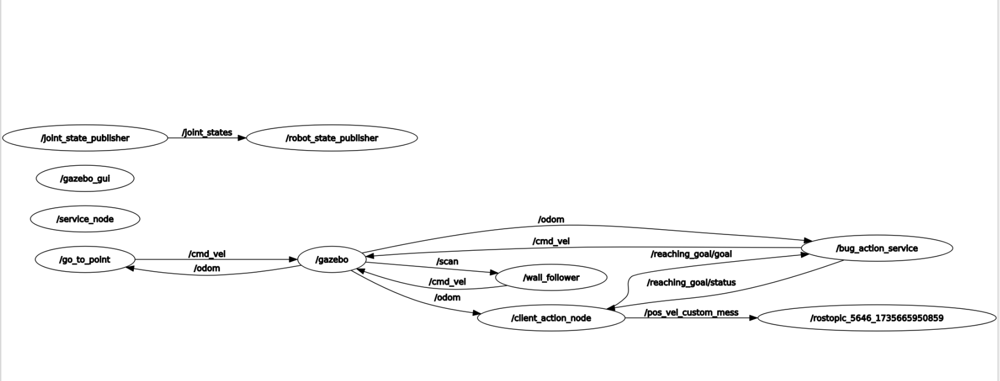

# Exercise 1: Action client and Action Server

## Overview
The exercise requires the implementation of the action client which has to communicate with the action server giving the target to reach (or to cancel) to the server, besides a custom message and custom server is needed. 
---

## Client Action Node

#### Methods:
- `messageCallback(const nav_msgs::Odometry::ConstPtr& msg)`:  
  **Type:** `void`  
  **Purpose:** retrives the robot position and velocity from odometry topic 
  
- `decide_action_in_moving( actionlib::SimpleActionClient<assignment_2_2024::PlanningAction>& client)`:  
  **Type:** `void`  
  **Purpose:** function called to allow the user to cancel the target or not, if the input not corresponds to one choice

- `set_target()`:  
  **Type:** `assignment_2_2024::PlanningGoal`  
  **Purpose:** function to set the target to reach and builds the goal to send.

- `feedbackCallback(const assignment_2_2024::PlanningActionFeedback::ConstPtr& msg)`:  
  **Type:** `void`  
  **Purpose:** function to retrieve the feedback.
  
## Main
Create the instance of the action server.
Define the subscriber for the position, feedback.
Define the puclisher of the custom message

If the feedback is not nullptr and i have reached the goal or it has been cancelled, the user can add another goal target. Otherwise, the robot is moving and the user can decide to spo

## Last tartget coodrinates service

#### Methods:
- `show_last_target_cooridinates(assignment_rt2_ex1::Service_target_coordinates::Request &req,assignment_rt2_ex1::Service_target_coordinates::Response &res)`:  
  **Type:** `bool`  
  **Purpose:** Reads the position fromt he parameters /des_pos_x and /del_pos_y.

### Adding the Graph

#### Generated RQT Graph
To visualize the node and topic connections in this package, the following graph has been generated:

---

